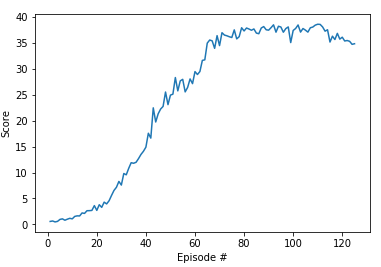

# Report
## The Learning algorithm
> DDPG algorithm (Deep Deterministic Policy Gradients) based on Udacity DRL ddpg-bipedal notebook was used to solve the environment. 

> The observation space, per agent, consists of 33 variables – corresponding to position, rotation, velocity, and angular velocities 
of the arm. Each action is a vector with four numbers with values between \[-1, 1\], corresponding to torque applicable to two joints.

## Model
Following structure was used for agent & critic:

+ Feature layer: Linear ReLu (33, 256)
+ First hidden layer: ReLu (256, 128)
+ Second hidden layer: Relu (128, 4)

## Hyperparameters
+ Learning rate (actor): 0.0001
+ Learning rate (actor): 0.001
+ Discount factor (gamma): 0.99
+ Target network update frequency (target_update_frequency): 1000
+ Policy network update frequency (update_frequency): 4
+ Replay memory capacity (buffer_size): 100000
+ Batch size (batch_size): 64

## Performance
> Agent achieves average score **30.0** over 100 episodes at 242 episode. 
At this moment, training could be stopped, task finished.
However, the learning continued and the mean score to end is 78.68.

## Result 

## Comments
During solving this problem, the biggest challenge was to set the learning rate & update frequency.
A small learning rate gave more stable training process, same was observed with update frequency of models. 
Too small was destabilizing training. 

## Future ideas
> I believe the results could be further improved using:

+ Actor and Critic NN could have more layers or more units per layer. The current setup was not stablizing, so increasing number of episode likely to result in higher scores.
+ Improvements made to DDPG, such as D3PG and D4PG, A3C and PPO will yield better result.
